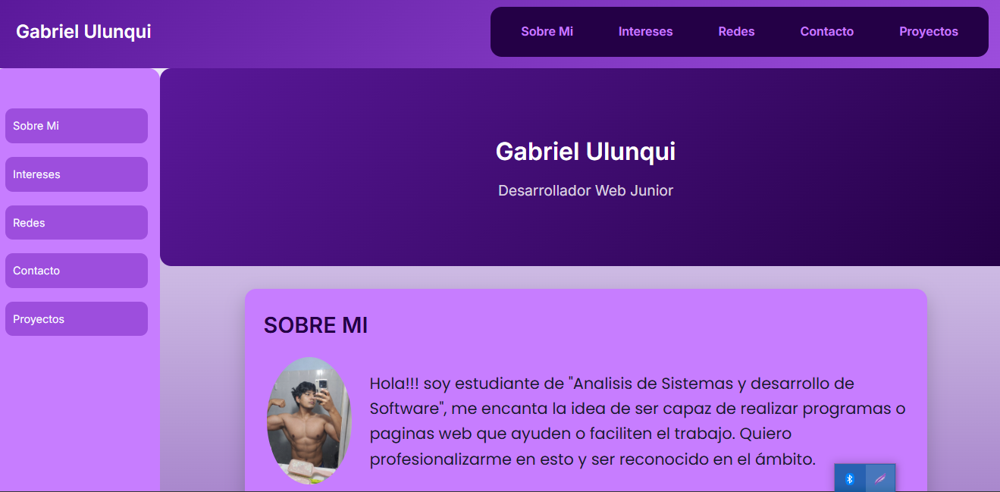
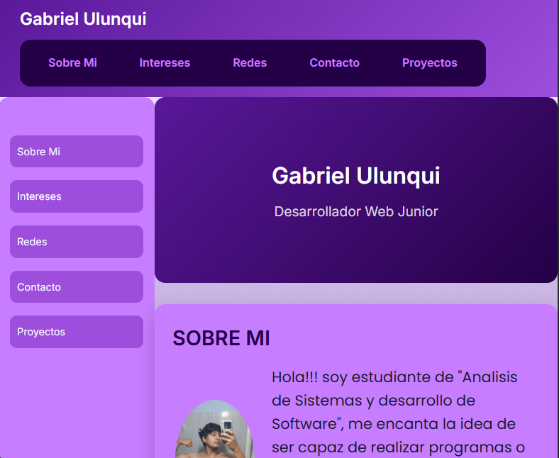
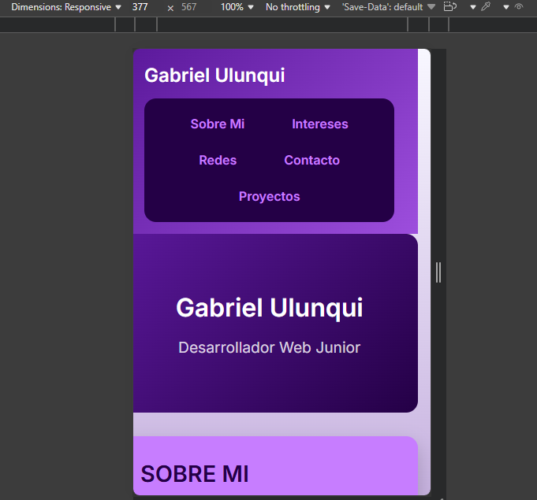

# ALUMNNO: Gabriel Ulunqui                                                16/03/26
**TP °1**  
   ## DESCRIPCION 
    En mi sitio web hay informacion sobre mi persona, como por ejemplo mis intereses (gustos o pasatiempos), quien soy y una informacion de contacto.
## TECNOLOGIAS UTILIZADAS
    Para la creacion del mismo utilice tegnologias como HTML5 en conjunto de CSS3.
## REFLEXXION
    Es importante aprender a utilizar la consola ya que al ser directamente con comandos agiliza bastante y reduce el tiempo de creacion de archivos algo que nos favorece, de paso nos sirve para aprender como se puede accceder a distintas direcciones o archivos sin la ncecesidad de tener una interfaz grafica. Es buena practica.
## RUTA DE INSTALACION 
    En mi caso, git esta instalado en la direccion c/User/Gabriel/mingw64/bin/git
    
## 🚀 Mi Página Web

Con lo aprendido en clases y con ayuda de nuestro profesor, fui capaz de desarrollar mi primera página web.

En este proyecto utilicé tecnologías como:
- HTML5
- CSS3
- Flexbox
- CSS Grid
- Responsive Design

A medida que continúe aprendiendo, el sitio se irá actualizando para mejorar su diseño y funcionalidad.

---

## 📱 Vista en diferentes dispositivos

### 💻 Escritorio

### 📲 Tablet

### 📱 Celular

# 🌐 Portfolio Web - Gabriel Ulunqui

🔗 [Ver sitio en vivo](https://gabrielulunqui.github.io/tp1-mi-sitio/)